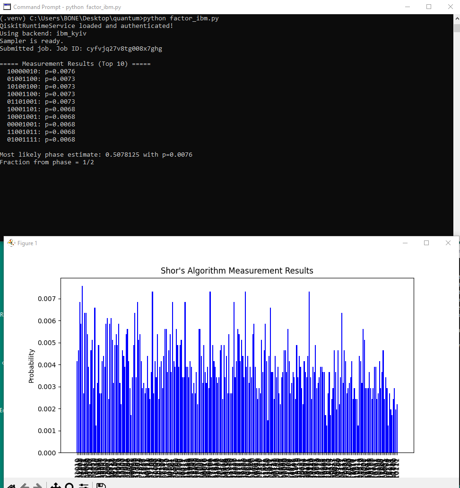

Quantum Shor's Algorithm for Integer Factorization

    shors_algorithm.py: The main Python script implementing Shor's algorithm using Qiskit and IBM's quantum services.

Setup

pip install -r requirements.txt

Set up IBM Quantum API Key:

    Sign up for an IBM Quantum account at IBM Quantum.
    Create a .env file in the root directory of the repository and add the following:

        IBM_QUANTUM_API_KEY=your_api_key_here

    Run the Script:
        Once the setup is complete, you can run the script shors_algorithm.py to execute the quantum circuit and factor the number 15.
        The script will output the measurement results and display a bar chart showing the probability distribution of the results.

Results

After running the algorithm, the script generates the following result, where the most likely phase estimate corresponds to the period rr, which is used to compute potential factors of the number 15.

Here is a plot of the measurement results:

Shor's Algorithm Results

The factors of 15 found by the algorithm are displayed as:

  gcd(7^(r/2) - 1, 15) = 3
  gcd(7^(r/2) + 1, 15) = 5
